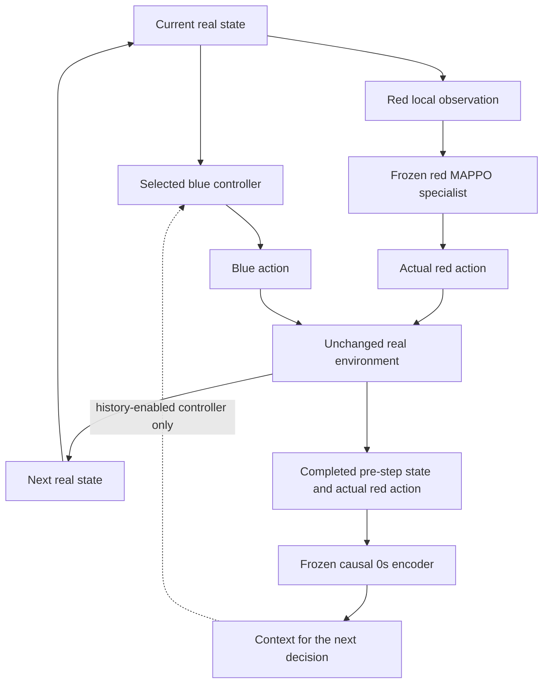
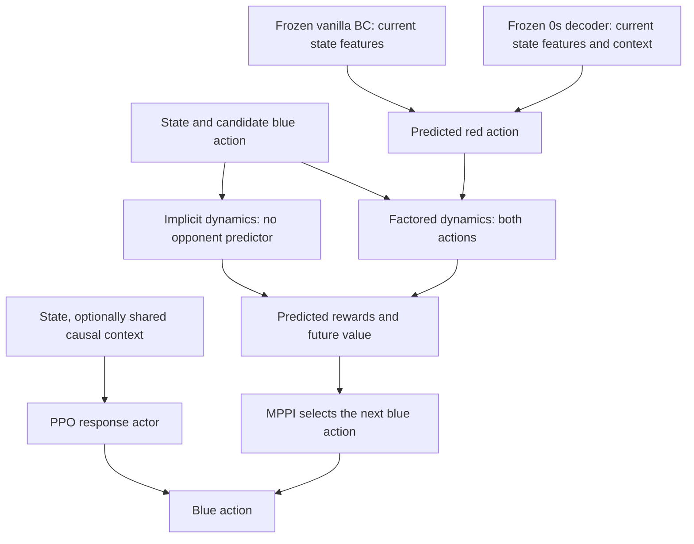

# Controller implementation

Implementation diagrams only. Inspect saved recordings before new rollouts or retraining.
No arrows below represent measured trajectories or demonstrated performance.

[All saved plots and interactive views](../experiments/behavior_dashboard/README.md)
are collected in the five-tab behavior dashboard, with source-run distinctions preserved.

## Current task and slide-ready summary (2026-09-08)

Keep the current one-red/one-blue task. Red specialists are trained for
capture (prey-seeking), risk aversion, or curiosity. Dataset collection and
controller runs use explicit objective/checkpoint groups with matched resets;
they do not independently draw a random type at every reset or switch types
mid-episode. A random-per-reset selector would be a separate implementation.

Distinguish two frozen components: the **real opponent** is a pretrained MAPPO
actor, while the **opponent model** is the pretrained `0s` encoder/decoder used
for inference and imagined red actions. Blue's world model/controller can be
trained while both stay frozen. Online context updates do not change `0s` weights.

Actions are already continuous: both agents use `(ax, ay)` in `[-1, 1]^2`.
The [boundary adapter](../src/tag_objectives/actions.py) preserves these forces
in JaxMARL's redundant continuous `[0, 1]^5` encoding; it does not discretize them.
The upstream file is `jaxmarl/environments/mpe/simple.py`, not `simply.py`.
Legacy discrete paths remain; this workflow explicitly requests `continuous=True`.

Here `x` is world state (normalized 66D state in the current inspector), `z`
is the separate 8D opponent-history representation, `u` is blue's action and
`v` is red's action.

| Equation | Predicted transition | Question |
|---|---|---|
| 1: implicit | `x_next = d(x, u)` | Is current state sufficient without explicit opponent context? |
| 2: conditioned | `x_next = d(x, u, z)` | Does history-conditioned dynamics help? |
| 3: factored | `v_hat = decoder(x, z)`; `x_next = d(x, u, v_hat)` | Can opponent action prediction be separated from shared physics? |

Equation 3 trains physics with **recorded** joint actions and uses predicted red
actions during imagination. Its physics/reward/continuation do not receive `z`
directly; Q and the blue policy prior still do. Consequently, the red-action
clamp tests fixed-input physics, not invariance of the entire replanning policy.
Current red predictions are deterministic, not samples from calibrated uncertainty.

[TD-MPC training](../scripts/run_tdmpc.py) supports offline replay and real
collection/update rounds, including the frozen-`0s` factored path. The new
`0s` Equation 2 model is offline-trained and visualized, but still needs an
8D-context online controller entry point; the generic conditioned CLI uses
legacy 3D context. Co-training and within-episode opponent switching remain out
of scope. The [matched benchmark](../experiments/matched_control_20260908/STATUS.md)
is paused, not completed.

Replace "Equation 1 works well, so the task is too easy" with: **if Equation 1
matches the conditioned methods under matched information, data and budgets,
this comparison has not established the need for explicit opponent context.**
State may already reveal enough behavior, or conditioning may be ineffective.
Keep Equation 1 as a genuine baseline; its identical prototype plots are an
architectural invariant, not evidence that it solves the task.

## Real environment versus imagined predictions



The learned opponent predictor never controls the real red agent. Both real
agents choose from the pre-step situation; context is updated only after the
actual red action has occurred. During imagined rollouts, context stays fixed.
The real red policy receives its local observation, not blue's full simulator
state or inferred opponent context.

## What the selected blue controller does



BC and 0s are alternative opponent predictors. Implicit and factored dynamics
are alternative world-model paths. PPO and MPPI are alternative blue action
selectors; these are not all running together to vote on an action.

## Information matching

- State-only group: implicit TD-MPC, BC-based TD-MPC, and state-only PPO.
- History-enabled group: 0s-based TD-MPC and PPO using the same frozen causal
  context function. Different trajectories naturally produce different contexts.
- Comparing the two groups changes history use; it does not by itself isolate
  latent representation quality.
- The new PPO baseline trains a blue response to frozen opponents. It is not
  the older jointly trained, local-observation MAPPO policy.

## Inspect before rerunning

Start with the saved matched MAPPO-prey and adapted factored `0s` TD-MPC
recordings in [main-env controller](../experiments/main_env_20260908/controller/).
Pair the same reset and red specialist; show actual red/blue paths, executed
actions, resources and lava on identical axes. Retain each run's environment
and checkpoint provenance: these are saved trajectories, not new experiments.

Keep three visualization objects separate:

- **Trajectory PCA:** a post-hoc projection of recorded behavior for comparison;
  its axes are not learned strategy coordinates.
- **`0s` latent:** the encoder's causal history representation `z[t]`, used by
  the opponent decoder. Plot its evolution alongside the corresponding path.
- **Actor hidden activations:** intermediate policy-network features, requiring
  explicit extraction; these are neither trajectory PCA nor the `0s` latent.

MAPPO chooses actions with its actor and has no online planner to visualize.
TD-MPC searches imagined futures, but the saved episode traces do not include
candidate populations or iteration-by-iteration elite selections. Real paths
alone cannot reveal what the planner predicted or why it selected an action.

After inspecting those recordings, the next diagnostic rollout should keep a
fixed checkpoint and record candidate action sequences, elite selections,
predicted red/blue paths, the executed action, actual next state and causal
`z[t]`. Compare predictions with the actual transition before changing the
controller. Retrain only when that diagnosis supports a specific change; no
rollout or training is launched by this document.

### Linked trajectory inspector

```bash
uv run --locked python scripts/visualize_controllers.py
```

This reads the six saved recording files listed by `evaluation.json`. It does
not load policies, step an environment, fit probes or report benchmark scores.
The output in `experiments/controller_inspection/` contains the compact trace
data, a hash-bound manifest, and an inline visualization fragment. Select an
objective/episode or a scatter point, then scrub both actual paths together.
Force arrows use recorded actions, not velocity estimates. Episodes stop at
their valid endpoint; the final state has no outgoing action.

The shared trajectory PCA uses both agents' displacement from their own initial
positions, resampled to 32 points over completed-episode phase. It preserves
orientation and arena distance, but removes initial location and absolute
duration. PCA is centered, unscaled, label-free and fitted on the displayed
cohort only for inspection. Colors name known opponent objectives, not inferred
clusters. Projection overlap/separation is not evidence of policy quality.

The separate `0s` views show either **every valid pre-action context** across
multiple episodes or each episode's **last pre-action context**, not final
post-terminal embeddings. The sample selector displays the first one, four,
eight, or all saved matched episode pairs per objective. Axes remain fixed when
filtering; no new samples are generated. Consecutive decision points are
correlated, not independent trials. Clicking one selects its source episode
and decision time. The selected trace follows `z[t]` up to that decision; at
termination the current-context ring disappears. These axes are also fitted
post-hoc. MAPPO's unused zero-context placeholders are excluded.

Unlike Shashank's learned-encoder geometry plots, trajectory PCA here describes
behavior directly; it does not expose MAPPO hidden activations or TD-MPC's
world-state representation. See his [panel definitions](https://github.com/hegde95/opponent-modeling/blob/opponent-trajectory-encodings/encoding_viz/REPORT.md#3-what-the-panels-plot).
The TD-MPC run uses an identity world-state encoder and a separate `0s` opponent
context. This is the adapted controller, not an unmodified upstream baseline.

### Mean-0s world-model inspector

The separate [three-equation inspector](../experiments/world_model_inspection/README.md)
shows imagined trajectories for capture/risk/curious mean latents under identical
initial states and fixed blue commands. It uses the original `continuous_0s`
base, not the adapted controller above. Equation 1 ignores `z`; Equation 2
conditions dynamics on `z`; Equation 3 routes `z` through predicted red actions.
Its red-action clamp and stop markings expose structural behavior, not control
performance. Reproduction restores checkpoints by default; fitting missing
models requires explicit `--fit-missing`.

## Code map

- [Vanilla BC and frozen opponent adapter](../src/mopa/bc_continuous.py)
- [0s encoder/decoder bridge](../src/mopa/zero_s.py)
- [World-model modes](../src/mopa/tdmpc.py) and [MPPI](../src/mopa/mppi.py)
- [State-only and history-enabled PPO responses](../src/mopa/response_ppo.py)
- [Shared real-environment loop](../src/mopa/evaluation.py)
- [Saved-trace inspector](../scripts/visualize_controllers.py) and [view](../scripts/controller_inspector.html)
- [Opt-in experiment runner](../scripts/run_control_benchmark.py)

Invoking the runner without `--execute` does not fit models, collect experience,
evaluate controllers, or report metrics. Investigate saved recordings first;
future diagnostic rollouts and retraining should follow the findings.
