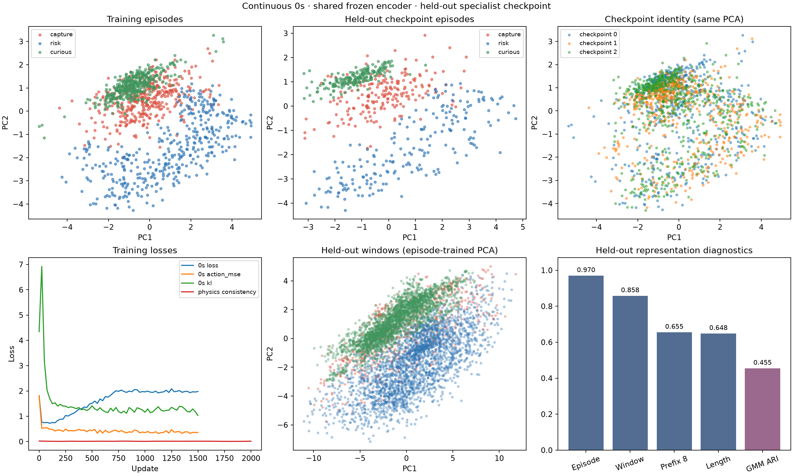
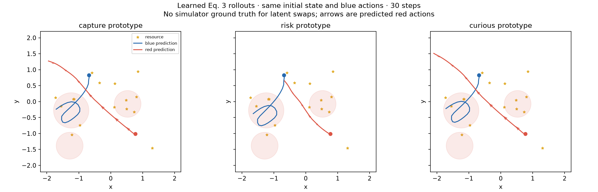

# Continuous 0s and Equation 3

[Source 0s report](https://github.com/hegde95/opponent-modeling/blob/7bae281091a96fc83cadad3671bef070bd371675/encoding_viz/REPORT.md); encoder seed 0, held-out specialist checkpoint 2.

One shared GRU64/window8/latent8 action-decoder VAE; train-only normalization and prototypes. Continuous adaptation uses recorded pre-action velocities (causal) and 2D tanh action reconstruction. Physics uses normalized 66D state and both actions; its frozen opponent decoder uses the selected 8D prototype.

`v_t = 0s_decoder(state_t, z); x_(t+1) = dynamics(x_t, blue_action_t, v_t)`

1200 training episodes; 600 held out. 1500 VAE updates and 2000 world-model updates. The three means are three 8D vectors, not three scalar latent coordinates. All labels are excluded from VAE fitting. This is a continuous adaptation, not a matched reproduction of the discrete source scores.

| Held-out diagnostic | Value |
|---|---:|
| Episode probe (posthoc) | 0.9700 |
| GMM ARI (posthoc) | 0.4550 |
| Window probe (posthoc) | 0.8580 |
| 8-completed-step prefix probe | 0.6550 |
| Length-only probe | 0.6483 |





Episode/window probes and reconstruction are posthoc; target actions enter their posterior. Prefix probes and causal action prediction use only completed history. Strategy means use training episodes; correct-prototype evaluation uses known type labels, so it is an oracle control, not online inference. Zero context is an ablation of this same trained decoder, not separately trained vanilla BC. PCA, scaling, probes, and full-covariance 3-component GMM fit training data only. Action errors in metrics.json are squared 2D-vector errors averaged within episodes and equally across types. Continuous errors are not comparable to the source's discrete accuracy.

| Held-out action prediction | MSE (lower is better) |
|---|---:|
| causal_history | 0.4847 |
| zero | 0.4964 |
| correct_prototype | 0.4723 |
| wrong_prototype_1 | 0.5128 |
| wrong_prototype_2 | 0.5130 |

These predictions are evaluated on recorded held-out states. They do not measure closed-loop performance.

The 8D agent-only input omits lava geometry visible to specialists, limiting attainable risk-policy fidelity.

Matched-state action MSE below evaluates each prototype against each held-out specialist on the same held-out scenes (up to four seeded valid steps per episode). Rows are prototypes, columns are specialist targets; compare rows within each fixed specialist column, since target difficulty differs across specialists. Queries on another specialist's visited states may be out of that policy's training distribution.

| Prototype | capture | risk | curious |
|---|---:|---:|---:|
| capture | 2.1131 | 1.7382 | 1.2970 |
| risk | 2.0988 | 1.5785 | 1.2607 |
| curious | 2.1267 | 1.7787 | 1.3019 |

Best prototypes for capture/risk/curious targets: risk, risk, risk. Only 1/3 named prototypes are the lowest-error choice for their matching specialist. Three-way behavior fidelity is not established by this run. Different trajectories under swapped z alone are insufficient.

Latent-swap plots use identical initial state and blue action sequence across all three prototypes. They are autoregressive learned rollouts with no simulator ground truth for the swaps. The fixed plot horizon does not reset or stop on predicted capture; post-capture states are extrapolations. Recorded-joint-action horizon 1/3/10 errors compare physics to persistence separately. Different paths alone do not establish correct strategy behavior. This run establishes component diagnostics, not control performance, online adaptation, or SOTA.

| Held-out physics horizon | Position RMSE | Persistence RMSE |
|---|---:|---:|
| 1 | 0.0151 | 0.0805 |
| 3 | 0.0427 | 0.2387 |
| 10 | 0.1281 | 0.6986 |

## Reproduce

From the repository root, with continuous data and specialist checkpoints present:

```bash
uv run --locked --extra train --extra plot python scripts/run_0s_world_model.py \
  --encoder-steps 1500 --updates 2000 --seed 0 --heldout 2 \
  --out experiments/continuous_0s
```

Reload opponent.msgpack with ZeroSOpponent.load; construct the identity/factored agent using config.json and state_stats.npz, attach the opponent decoder, then restore agent.msgpack with flax.serialization.from_bytes. The attached apply function is static and must be reconstructed before restoring parameter bytes.
