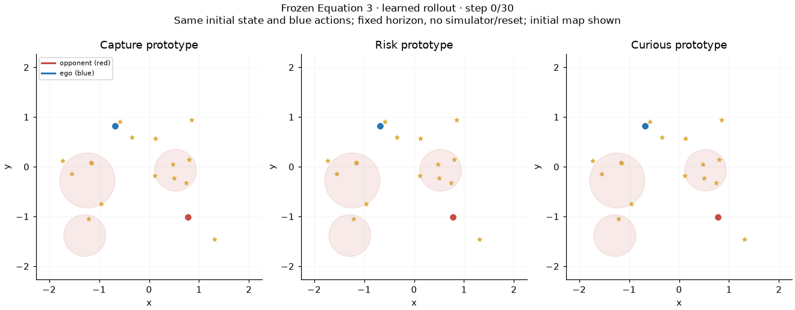
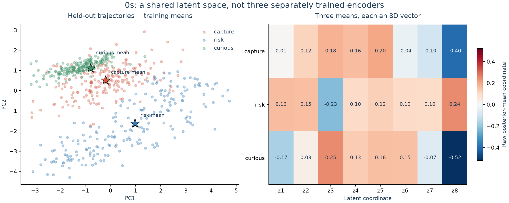
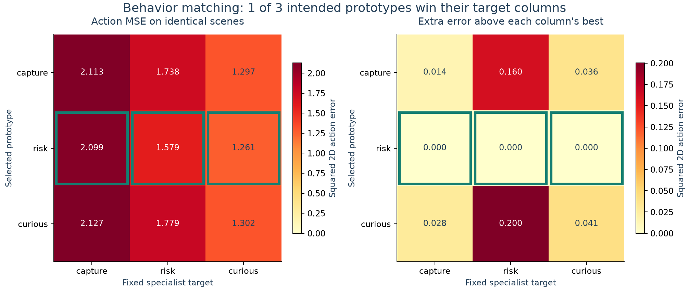
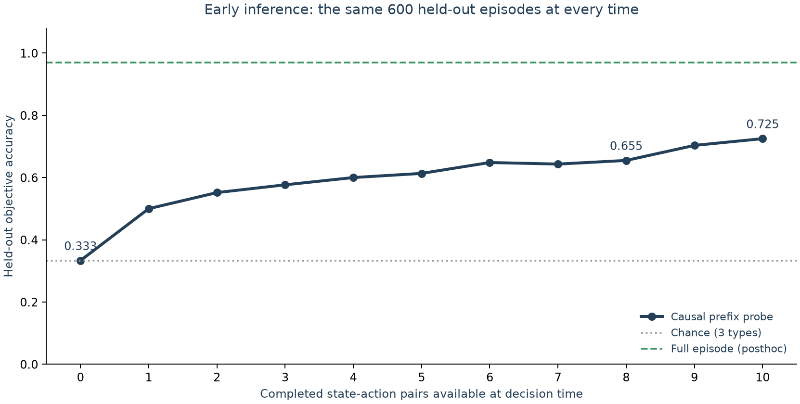
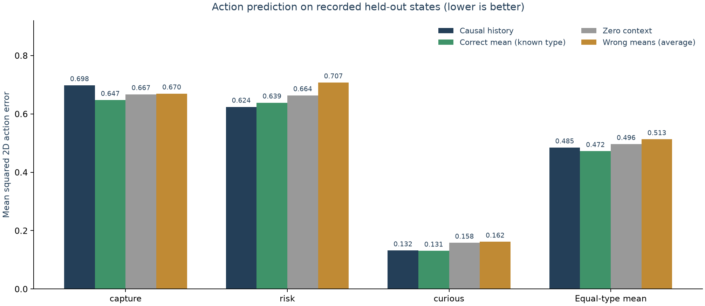
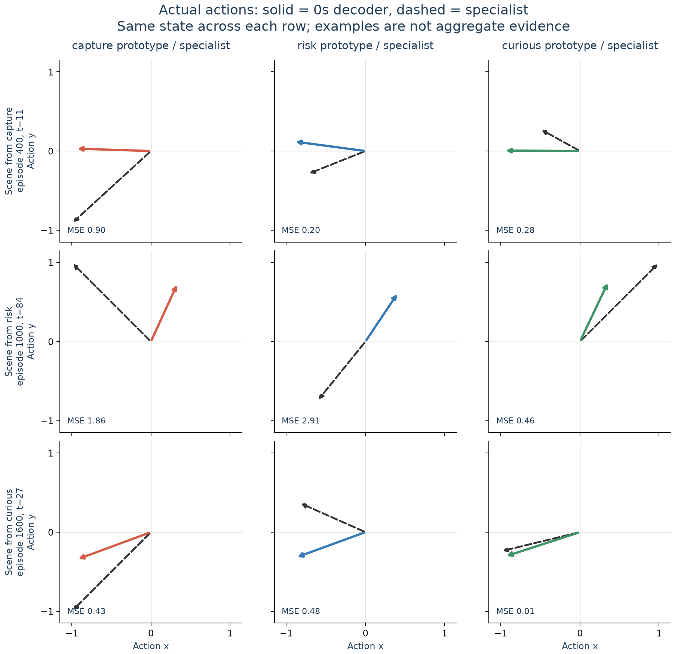
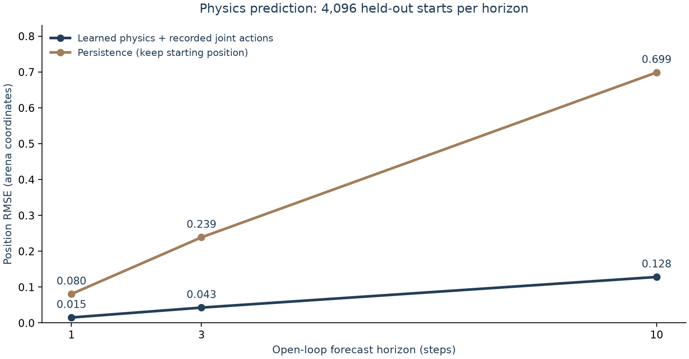
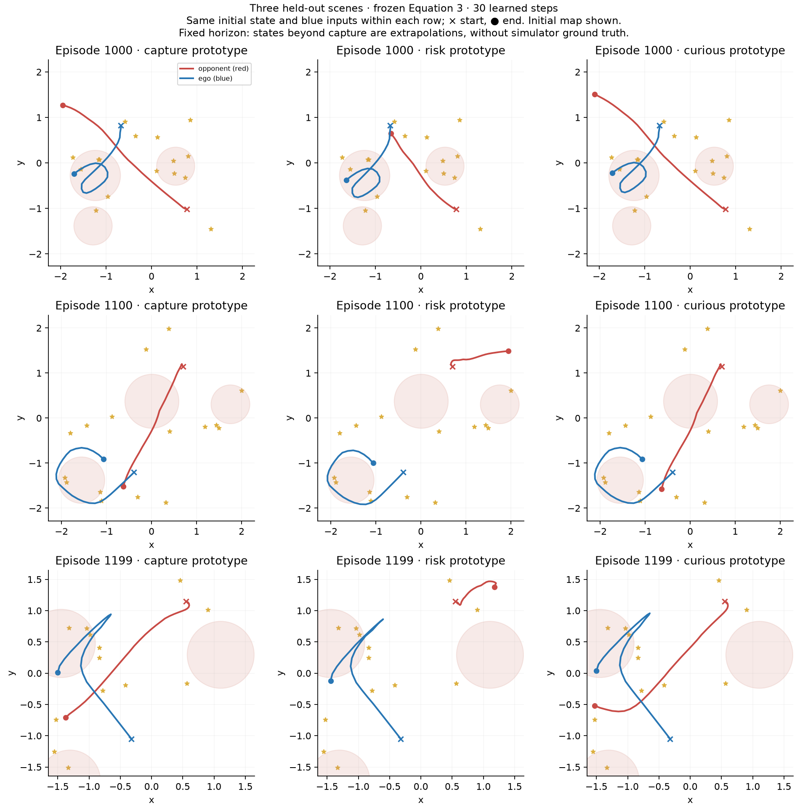

# 0s visual gallery

Saved encoder seed 0; specialist checkpoint 2 held out. No encoder or world-model retraining.

## Watch the latent swap

Same starting state and blue action sequence; only the 8D prototype changes. Red is the opponent, blue is the controlled agent. These are learned model predictions, not simulator ground truth. Fixed-horizon paths can continue past capture.



## Where the three means sit

Held-out episode latents use the saved training-fitted PCA. Stars are training-only means. Heatmap values are the eight raw latent coordinates, not strategy probabilities.



## Does each mean produce the right behavior?

All prototypes and specialists see identical scenes. Compare rows within a specialist column. Outlined cells are column minima; lower error is better. The diagonal cells correspond to the intended strategy matches.



## How much can be inferred early?

Fresh linear diagnostic probes use saved causal prefixes, fitting only training episodes. The encoder is frozen. All plotted times use the same episodes, with no survivor filtering. The full-episode comparison has access to later behavior.



## Does latent conditioning help prediction?

Errors are averaged within episodes and then across types. Known-type means are an oracle control; zero context is the same decoder with z=0, not separately trained vanilla BC. Wrong means average the two fixed cyclic swaps.



## What actions do the means produce?

One deterministic example from each recorded behavior: first saved scene per type. Each column compares a prototype with its corresponding specialist on the identical state. Solid arrows are the decoder; dashed arrows are the specialist. These are actions, not trajectories.



## Can the learned physics predict motion?

Recorded joint actions isolate the physics model. Both curves use identical held-out start states. This does not measure the quality of the learned opponent or closed-loop control.



## Does the effect repeat in other scenes?

Three deterministic held-out scenes, three means each. Same initial state and blue actions within each row. No success-based selection; these are qualitative forecasts, not validated strategy control.



## Reproduce

From the repository root:

```bash
uv run --locked --extra train --extra plot python scripts/visualize_0s.py
uv run --locked --extra train --extra plot python scripts/visualize_0s_rollouts.py
```

The two manifests here bind the figures to the saved arrays/checkpoints. The original run report, models and manifest are unchanged.
