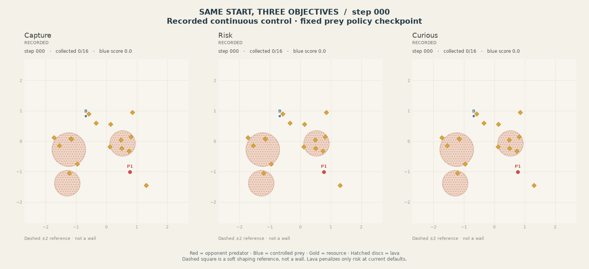
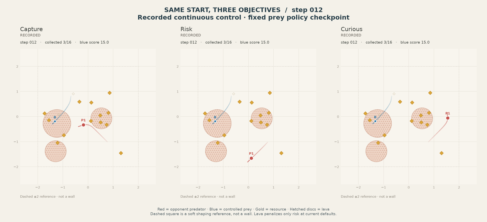
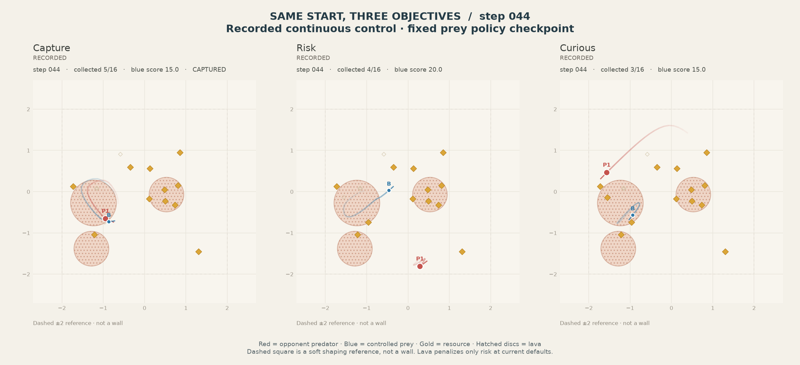
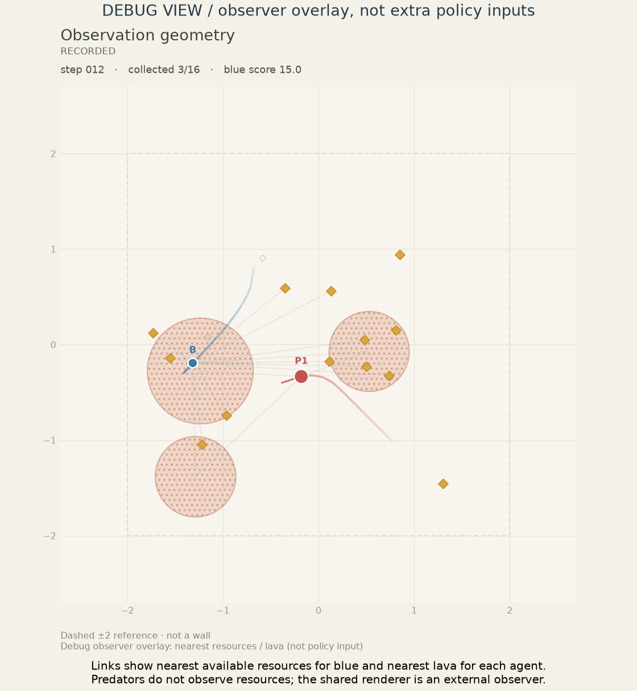

# Environment presentation

One renderer, existing data, unchanged simulation. Predator objectives are observer labels, never new policy inputs.









Checkpoint 2, group episode 0; absolute episode IDs [400, 1000, 1600]. Starts and reset keys match; blue actions may differ as the fixed policy reacts to each opponent. Captured panels hold their observed terminal frame while other panels continue. The fixed offline viewport includes the whole shown clip. These examples are not aggregate performance results.

```bash
uv run --locked --extra train --extra plot python scripts/render_environment.py
```

Rendering and data checks: [manifest](manifest.json). Visualization options: [catalog](../../docs/VISUALIZATION.md).
