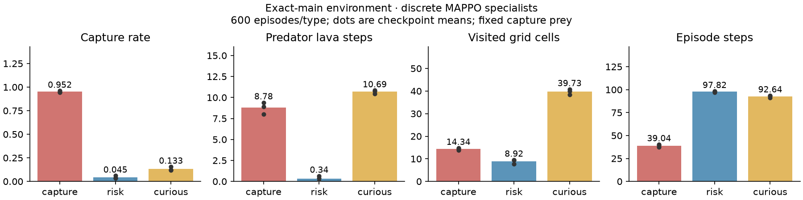

# Main-branch environment rerun

The previous version was backed up first as **`new-env`**, at `180571b`.
The active `td-mpc2` branch now uses `objectives.py` and `resources.py`
byte-identical to fetched **`main@8c24db3`**. Existing continuous callers are
supported by the external API/action adapter; no second environment was added.

**The rollback does not change the measured behavior.** Before replacement,
main and the backup produced 360 identical discrete/continuous transitions,
including all observations, states, rewards, done flags and info. Their task
defaults already matched. Main also retains soft boundary penalties, not walls.

## Real specialist behavior

Fresh native-main discrete rollouts: 1,800 episodes, 600 per objective, three
checkpoint seeds and matched resets, with a fixed capture-prey family.

| Specialist | Capture rate | Mean lava steps | Mean visited cells |
|---|---:|---:|---:|
| Capture | 95.17% | 8.78 | 14.34 |
| Risk | 4.50% | 0.34 | 8.92 |
| Curious | 13.33% | 10.69 | 39.73 |

The native specialists show aggregate capture/avoidance/exploration distinctions.
That is different from asking the **learned `0s` decoder/world model** to generate
three faithful behaviors. In particular, main rewards risk with `10*capture −
100*lava` and curious with `10*capture + 0.5*new_cell`; neither has dense chase
shaping at default settings. Risk/curious are not guaranteed to chase actively.

First matched real-specialist episodes, without success selection:
[capture GIF](discrete/replays/capture.gif),
[risk GIF](discrete/replays/risk.gif),
[curious GIF](discrete/replays/curious.gif).

## Experiments rerun

- **Native discrete data:** all 18 arrays and dataset SHA are unchanged;
  137,698 valid transitions. Source `0s`, integrated source-compatible port,
  and three causal fit seeds were trained again for 1,500 updates each.
  Every reported probe/ARI/decoder metric matches the previous run exactly.
  Causal episode probe is **0.734 ± 0.046**, GMM ARI **0.525 ± 0.017**.
  These are post-hoc representation metrics, not proof of behavior control.
  [Full discrete report](discrete/REPORT.md).
- **Continuous data:** regenerated all 1,800 episodes / 130,869 valid
  transitions. All 26 arrays and dataset SHA are unchanged; full simulator
  replay has zero error. The continuous policies remain separate from main's
  native discrete policies. [Dataset audit](continuous_data/report.json).
- **Continuous control:** reran the saved six-round adapted controller and
  MAPPO/random controls, 24 held-out episodes per opponent. No new controller
  or specialist training, reward tuning or model selection was performed.

| Opponent | `new-env` saved TD-MPC | Main-source rerun | MAPPO reference |
|---|---:|---:|---:|
| Capture | −2.43 | −2.43 | −0.61 |
| Risk | +8.70 | +8.70 | +26.57 |
| Curious | +6.04 | +6.04 | +25.85 |
| Overall mean | +4.10 | +4.10 | +17.27 |

One controller seed; no SOTA or latent-conditioning benefit is established.
Changing to main's source has not solved weak learned three-way behavior.
The real specialist policies, learned opponent predictions, and prey-controller
performance must remain separate claims.

## Verification and provenance

72 focused tests passed; Ruff and diff checks passed. Exact main-source hashes,
the preserved `new-env` ref, continuous simulator replay, and equality of all
nine matched controller arms are checked by [verification.json](verification.json).
[Source provenance](../../third_party/marl-opp-aware/UPSTREAM.md) preserves the
earlier original-repository audit as history.

[Protocol and commands](PROTOCOL.md) · [native fit provenance](discrete/main_provenance.json) ·
[controller metrics](controller/evaluation.json).
All output paths are new. Previous data, checkpoints and reports are preserved;
large NPZ/checkpoint files remain local and git-ignored.
