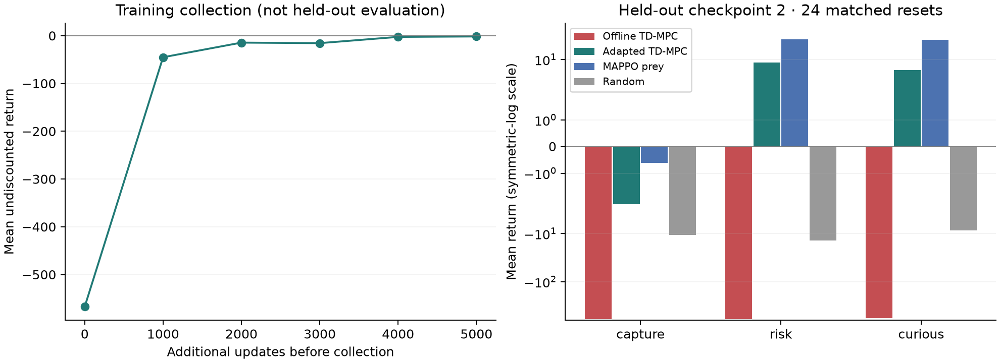

# Original environment restoration and controller retraining

The retrained `0s` + Equation 3 controller achieves **+4.10 mean held-out return**,
up from **−588.22**. This is a substantial control improvement, but it remains
below the fixed MAPPO prey (**+17.27**), and capture-opponent return is still negative.

## Matched results

One controller seed; 24 matched reset keys per opponent against held-out
specialist checkpoint 2. Values are mean ± episode standard deviation, **not
variation across training seeds**. Same continuous actions and original rewards.

| Opponent | Offline `0s` TD-MPC | Retrained `0s` TD-MPC | MAPPO prey | Random |
|---|---:|---:|---:|---:|
| Capture | −598.35 ± 370.67 | −2.43 ± 8.05 | −0.61 ± 6.98 | −10.58 ± 20.66 |
| Risk | −597.05 ± 365.04 | +8.70 ± 16.49 | +26.57 ± 13.71 | −13.83 ± 39.27 |
| Curious | −569.25 ± 411.31 | +6.04 ± 11.83 | +25.85 ± 16.37 | −8.52 ± 16.07 |
| Overall mean | −588.22 | +4.10 | +17.27 | −10.98 |

The adapted mean's 95% reset-cluster bootstrap interval is **[+0.37, +7.71]**;
the paired improvement is **+592.32 [461.51, 723.20]**. Resampling keeps the
three opponents together for each reset (10,000 bootstrap samples). These
intervals condition on this one trained model; they do not establish seed robustness.
Return improves in 69/72 matched episodes. The earlier two-episode execution
smoke is not the baseline here; both arms use the same expanded 24-reset protocol.

## What changed

- Restored the original `rlogger/marl-opp-aware@aecbab5` source, with only package
  and continuous-API adaptations. [Exact provenance](../../third_party/marl-opp-aware/UPSTREAM.md).
  The pre-restoration code is saved on `archive/pre-original-env-20260908` at `6721cf0`.
- Regenerated all 1,800 episodes. All 26 arrays and the dataset hash match the
  previous data exactly; 130,869 transitions replay with zero error. Thus the
  redesign had not changed these dynamics. Restoration itself did not cause the gain.
- Continued the saved controller for six predeclared rounds: 288 fresh episodes,
  24,703 transitions, and 6,000 additional updates (8,000 total). Collection uses
  training specialists 0/1 only. Replay mixes old and new transitions uniformly.
- Kept `0s`, normalization, planner configuration, physics and rewards unchanged.
  The controller's dynamics, reward, value, policy and continuation heads learn;
  the identity encoder and opponent decoder do not change.

## Why behavior improved—and what remains weak

The old model underestimated boundary penalties even with the **actual** red
action supplied. On fixed old smoke states, outside-arena reward MAE dropped
from **9.64→1.77**, **7.90→1.18**, and **8.25→1.69** after retraining
([before](reward_diagnostic.json), [after](reward_diagnostic_adapted.json)).
This supports improved reward calibration; it is not an isolated proof of cause.

In the fresh held-out evaluation, fractions of valid transitions ending outside
±2 fall from **77.4%, 71.7%, 69.8%** to **0%, 1.25%, 3.04%** for
capture/risk/curious. No walls or state clamping were added.

Staying near the arena trades escape for more capture encounters: capture
opponents now catch the prey in **19/24** episodes, versus **1/24** before.
Resource collection improves but remains below MAPPO. This run does **not**
establish a benefit of latent conditioning over separately trained vanilla BC,
faithful three-way latent behavior control, or SOTA performance. `0s` probe/ARI
training was not rerun; the encoder and its dataset are unchanged.

## Replays and verification

First matched episode from every group, never selected by outcome:
[capture GIF](final/capture__tdmpc__online.gif),
[risk GIF](final/risk__tdmpc__online.gif),
[curious GIF](final/curious__tdmpc__online.gif).
The fixed arena-scale camera shows true positions and flags off-screen agents;
it does not change the recorded simulation.

126 focused regression tests passed across environment/replay, `0s` adaptation,
legacy continuous integration, world-model and upstream-parity suites. Ruff passes.
The [artifact audit](verification.json) checks simulator replay, true specialist
actions, causal context, train/held-out isolation and parameter changes.
All 48 recorded trace files (576 episodes, 49,094 valid transitions) replay with
zero state, reward or specialist-action error. Causal context error is at most
9.54e-7; perturbing future pairs changes past contexts by exactly zero.

[Protocol and commands](PROTOCOL.md) · [comparison data](comparison.json) ·
[baseline metrics](baseline/evaluation.json) · [final metrics](final/evaluation.json) ·
[training manifest](adapted/manifest.json).
Raw NPZ data and model weights remain local and git-ignored; manifests contain
their hashes. Runtime timings include host pauses and are not speed benchmarks.
