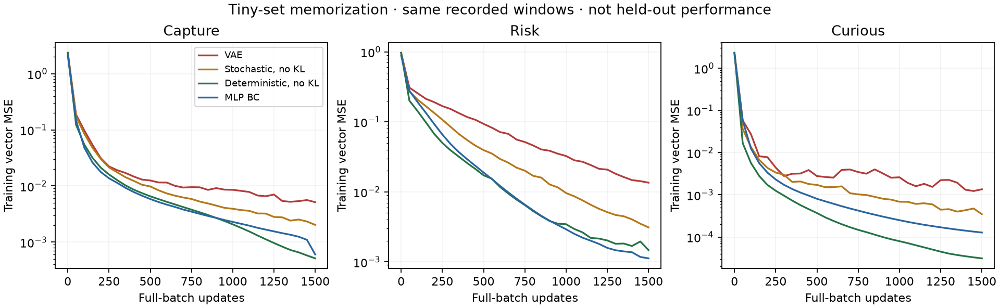
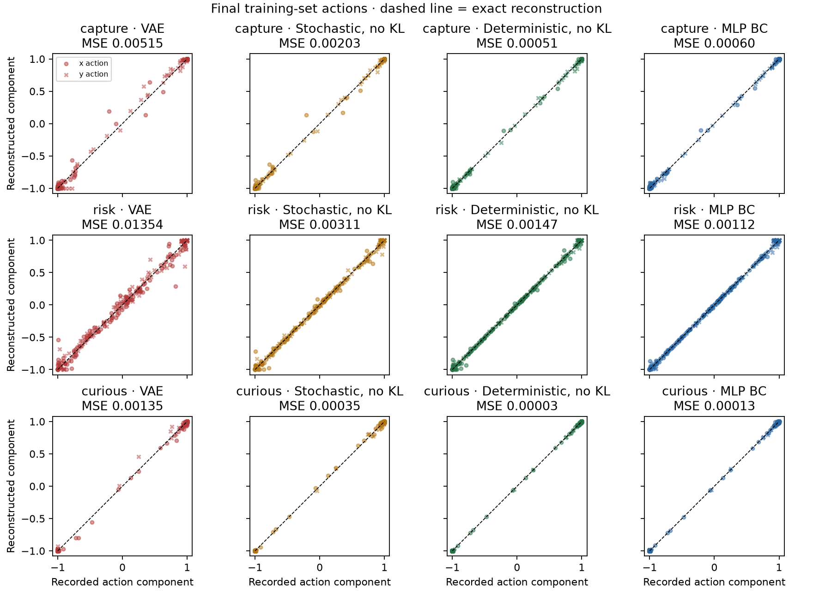

# `0s` reconstruction: tiny-set diagnostic

The networks can fit a small, fixed set of recorded actions. Under the same
1,500-update budget, removing KL improves reconstruction for every behavior;
also removing latent sampling improves it further. Plain MLP BC fits well too.
This identifies a regularization/sampling cost **on these training examples**,
not the cause of the full-dataset held-out error or a controller improvement.

## Results

Final **training-set squared 2D action error**, averaged over 128 transitions per
behavior. Lower is better. Latent models use posterior means for this table.

| Model | Capture | Risk-averse | Curious |
|---|---:|---:|---:|
| VAE: sampled latent + KL during training | 0.005151 | 0.013535 | 0.001352 |
| Sampled latent, no KL | 0.002029 | 0.003106 | 0.000348 |
| Deterministic latent, no KL | 0.000515 | 0.001471 | 0.000031 |
| Plain MLP BC | 0.000605 | 0.001122 | 0.000128 |
| Constant training-mean action | 1.755734 | 0.790460 | 1.530540 |





The VAE's average errors are small but not uniformly small: maximum per-action
squared vector errors are 0.158742 / 0.285868 / 0.042466 for capture / risk /
curious. The corresponding maxima for BC are 0.011219 / 0.015888 / 0.003017.
The plots show the remaining outliers rather than just the means.

## What this tells us

- There is no basic inability of the encoder/decoder architecture to fit this
  tiny dataset. The deterministic version achieves very low reconstruction
  errors; the VAE also substantially reduces error, but fits less accurately.
- The stochastic no-KL arm changes only the penalty relative to VAE, keeping
  initial parameters and sampling keys fixed. Its improvement implicates KL
  regularization in the finite-budget fitting gap here. Removing sampling as
  well yields another improvement. This does not isolate a universal effect
  across seeds, dataset sizes, or generalization settings.
- Good tiny-set reconstruction does not establish meaningful strategy latents.
  Setting the trained VAE's latent to zero barely changes capture error
  (0.005151 to 0.005164) or curious error (0.001352 to 0.001241). Risk depends
  more on context (0.013535 to 0.030464). This is evidence of weak decoder
  reliance on context for two of these fits, not proof of posterior collapse
  in the original trained model. The posterior means vary across windows.
- The no-KL models rely much more on their window latents, but those latents
  have seen the target actions. They could encode window-specific details;
  this is not evidence of causal strategy prediction or useful prototype swaps.
- Do not replace the production VAE or declare BC the winner from memorization.
  Next, if authorized, evaluate the same controls on the full training set and
  held-out checkpoint with separately reported reconstruction and causal action
  prediction. No such full-data run was performed here.

## Exact scope and reproduction

- One training seed: 0. Each behavior fitted independently using specialist
  checkpoint 0 only; checkpoint 1 and held-out checkpoint 2 were excluded.
- Sixteen seeded episodes per behavior, one complete eight-step window per
  episode, selected before inspecting errors. There are 384 unique recorded
  transitions total, reused across the four model arms. No new rollouts.
- Identical eight-dimensional position/velocity features, selected examples,
  full-batch updates, Adam learning rate 0.001, two 64-unit ReLU decoder layers,
  tanh action bounds, and normalization fitted only to the selected examples.
- Latent width 8 and GRU width 64. The VAE uses the production beta ramp to 1
  over half the run and 0.2 free bits per dimension. It reuses the production
  encoder, decoder, vector-MSE, and KL functions.
- The three latent models start from exactly the same parameters. BC copies
  the VAE decoder's state-input rows and all subsequent weights, dropping the
  latent-input rows. It is a plain state-only MLP. This intentionally matches
  the VAE initializer, not the production BC head's smaller initializer.
- Each latent model has 32,146 parameters, including the unused log-variance
  head in the deterministic arm; BC has 4,866. Equal updates/examples are not
  equal capacity or computation. Full-batch fitting and tiny-set normalization
  differ from the original full-dataset training protocol.
- Curves use deterministic full-set evaluation after updates, not stochastic
  minibatch losses. `results.json` separately includes reconstruction over 32
  sampled-latent draws, raw/floored KL, latent controls, selected episode/window
  IDs, dependency versions, source hashes, and timing.
- Source dataset: `artifacts/continuous/dataset.npz`, SHA256
  `928181027a9e5e86b106190b1487cda90c09e2cc5df08b569f7b93ba8350b5f5`.
  Execution used a byte-identical copy outside iCloud; its temporary path is
  recorded in `results.json`. Arrays, normalization, targets, and predictions
  are saved locally in `predictions.npz` (ignored by the repo's NPZ rule).
- No production code, model checkpoint, controller, dashboard, or dependency
  pins were changed. Only the diagnostic runner, its tests, and these artifacts
  were added. Existing unrelated worktree changes were preserved.

From the repository root, use a **new** output directory:

```sh
uv run --locked --extra plot python scripts/diagnose_0s_reconstruction.py \
  --dataset artifacts/continuous/dataset.npz \
  --out experiments/reconstruction_diagnostic_repeat \
  --windows 16 --steps 1500 --seed 0 --checkpoint 0

uv run --locked --extra dev pytest -q \
  tests/test_reconstruction_diagnostic.py tests/test_action_decoder.py
```

Verified: 18 focused tests passed; targeted Ruff and `git diff --check` passed.
