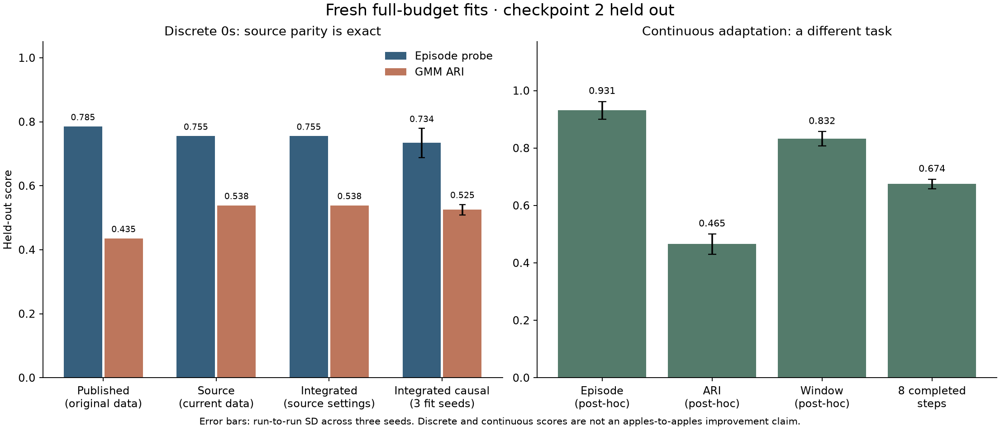

# Fresh comparison with Shashank

All 13 source encoders, the matched integrated port, three causal discrete fits, and three continuous `0s` + Equation 3 fits were rerun at full budgets. Specialist checkpoints and dynamics are unchanged. The fresh continuous collection is identical to the previous 26 arrays and exactly replays all 1,800 episodes. The visual upgrade therefore does not constitute a numerical improvement.

## 0s comparison

| Run | Episode probe | GMM ARI | Window probe | Reconstruction acc. |
|---|---:|---:|---:|---:|
| Shashank published (historical data) | 0.785 | 0.435 | 0.547 | 0.829 |
| Source code, fresh current discrete data | 0.755 | 0.538 | 0.566 | 0.789 |
| Integrated port, identical source settings | 0.755 | 0.538 | 0.566 | 0.789 |
| Integrated causal features, 3 fits | 0.734 ± 0.046 | 0.525 ± 0.017 | 0.581 ± 0.031 | 0.763 ± 0.001 |

Published values: [pinned source results](https://github.com/hegde95/opponent-modeling/blob/7bae281091a96fc83cadad3671bef070bd371675/encoding_viz/results.json). Original data are unavailable: the historical collection used objective-specific prey policies and different checkpoints; current data use the fixed capture-prey family. Only the two same-data source/port rows test implementation parity. Their maximum latent, loss-history, and accuracy differences are `0`.

Reconstruction accuracy follows the source definition: all valid samples, including training episodes, using a posterior that saw the target actions. It is not held-out next-action accuracy. Legacy features also include `p[t+1] - p[t]`, exposing the current action's transition; legacy mode is replication-only. Recommended causal features use past displacement, but pooled episode/window scores remain post-hoc. The recommended held-out reconstruction is separately `0.796 ± 0.002`. Source key 1000 corresponds to logical seed 0; discrete causal keys are 1000/1001/1002.



## Current continuous implementation

This is the 2D tanh-action adaptation with actual pre-action velocities, not a reproduction of discrete action accuracy. All three fits use 1,200 training / 600 held-out episodes, GRU64/window8/latent8, 1,500 encoder updates, and 2,000 Equation 3 updates. Direct model keys are 0/1/2. Means are three training-only 8D vectors. Mean ± population SD measures run-to-run variability, including seeded GMM initialization and evaluation-state sampling where applicable; it is not uncertainty across held-out checkpoint folds.

| Diagnostic | Mean ± SD |
|---|---:|
| episode_probe | 0.931 ± 0.031 |
| window_probe | 0.832 ± 0.025 |
| prefix8_probe | 0.674 ± 0.016 |
| length_only_probe | 0.648 ± 0.000 |
| gmm_ari | 0.465 ± 0.035 |
| window_balanced_accuracy | 0.679 ± 0.030 |

Window accuracy weights windows, so longer episodes contribute more; balanced accuracy is included to expose this imbalance. Completed-history prefixes use no future actions. Length-only evidence is a post-hoc shortcut, not an online baseline.

| Fit seed | Episode probe | ARI | Window probe | Prefix 8 | Correct prototype matches |
|---|---:|---:|---:|---:|---:|
| 0 | 0.970 | 0.455 | 0.858 | 0.655 | 1/3 |
| 1 | 0.895 | 0.512 | 0.799 | 0.695 | 1/3 |
| 2 | 0.928 | 0.428 | 0.840 | 0.673 | 1/3 |

| Held-out action control | Squared 2D action error, lower is better |
|---|---:|
| causal_history | 0.491 ± 0.004 |
| zero | 0.495 ± 0.002 |
| correct_prototype | 0.477 ± 0.003 |
| wrong_prototype_1 | 0.510 ± 0.005 |
| wrong_prototype_2 | 0.510 ± 0.007 |

Errors average within episodes and equally across objective types. Correct prototypes use known type labels (oracle). Zero is an ablation of the same decoder, not separately trained vanilla BC. Correct-prototype match counts are [1, 1, 1], each out of three specialist columns. All three seeds select the risk prototype as best against every specialist. Distinct latent clusters and changed paths do not establish faithful three-way behavior control. The decoder's 8D kinematics omit lava features available to specialists. No online adaptation, closed-loop control advantage, or SOTA claim follows from these results.

| Physics horizon | Model position RMSE | Persistence RMSE |
|---|---:|---:|
| 1 | 0.016 ± 0.000 | 0.080 ± 0.000 |
| 3 | 0.044 ± 0.001 | 0.239 ± 0.000 |
| 10 | 0.131 ± 0.002 | 0.697 ± 0.001 |

Recorded joint actions isolate physics accuracy; these errors do not validate the opponent model. [Fresh latent/control visuals](continuous/seed_0/visuals/README.md) and [new environment replay](environment/replay.gif) use the fresh run/data, without success-based selection.

## All 13 source encoders

Same pinned source and full default budgets: 1,500 sequence or 3,000 point updates; no quick fits. This is a one-fit-per-strategy current-data rerun, not a multi-seed ranking. Source PCA/diagnostic figures are regenerated; optional t-SNE/UMAP maps are omitted.

| Tag | Encoder | Published probe | Fresh probe | Published ARI | Fresh ARI |
|---|---|---:|---:|---:|---:|
| 0 | `sa_seq_action_decoder_vae` | 0.668 | 0.640 | 0.086 | 0.231 |
| 0s | `sa_short_seq_action_decoder_vae` | 0.785 | 0.755 | 0.435 | 0.538 |
| 1 | `obs_vae` | 0.478 | 0.463 | 0.395 | 0.436 |
| 2 | `obs_seq_vae` | 0.880 | 0.607 | 0.641 | 0.206 |
| 2s | `obs_short_seq_vae` | 0.402 | 0.373 | 0.242 | 0.337 |
| 3 | `obs_jepa` | 0.678 | 0.688 | 0.313 | 0.335 |
| 4 | `obs_seq_jepa` | 0.748 | 0.632 | 0.221 | 0.111 |
| 4s | `obs_short_seq_jepa` | 0.592 | 0.487 | 0.136 | 0.002 |
| 5 | `state_seq_pca` | 0.365 | 0.313 | 0.733 | 0.702 |
| 5s | `state_short_seq_pca` | 0.382 | 0.328 | 0.377 | 0.369 |
| 6 | `sa_vae` | 0.367 | 0.347 | 0.372 | 0.344 |
| 7 | `sa_seq_vae` | 0.875 | 0.558 | 0.761 | 0.039 |
| 7s | `sa_short_seq_vae` | 0.335 | 0.372 | 0.557 | 0.348 |

`sa_short_seq_action_decoder_vae` has the highest linear probe in this fresh single-fit suite; `state_seq_pca` has the highest ARI. This is not dominance across metrics or a multi-seed SOTA result. The large changes in the original sequence VAE scores occur with unmodified source code on different data, not from the integrated port.

Source length-only probe: published 0.642, fresh 0.617. See [source figures](upstream/images/summary.png), [source results](upstream/results.json), [discrete parity and seeds](discrete/metrics.json), [machine-readable comparison](comparison.json), and [protocol](PROTOCOL.md). The unmodified source trajectory overview retains mixed-map overlays and fixed axes; use the new environment replay for faithful individual scenes.

## Verification and reproduction

35 focused tests passed. Data/checkpoint/code hashes, actual commands, and timing are recorded in the per-arm manifests/logs. The initial continuous attempt encountered an offloaded-file read failure; it is retained in execution logs and was retried using verified local bytes. No failed fit was selected or counted as a completed run. Dataset regeneration reuses fixed specialist checkpoints; no policy training, reset fix, additional equation, or new BC implementation was performed.

```bash
uv run --locked --extra plot python experiments/shashank_comparison_20260908/summarize.py
```

This command summarizes completed fits only. See each arm's provenance/execution record for full training commands. Previous result directories remain untouched.
