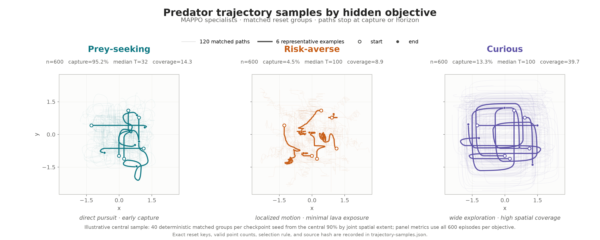
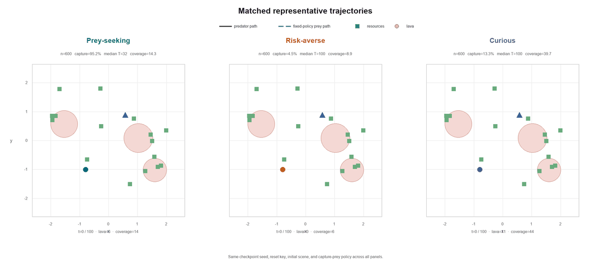
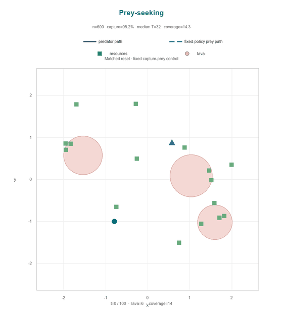
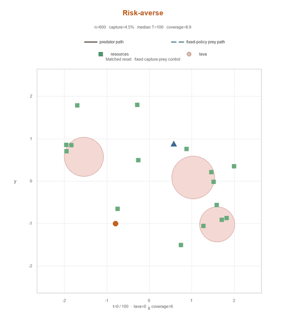
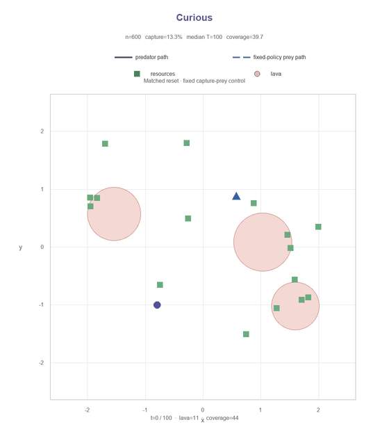
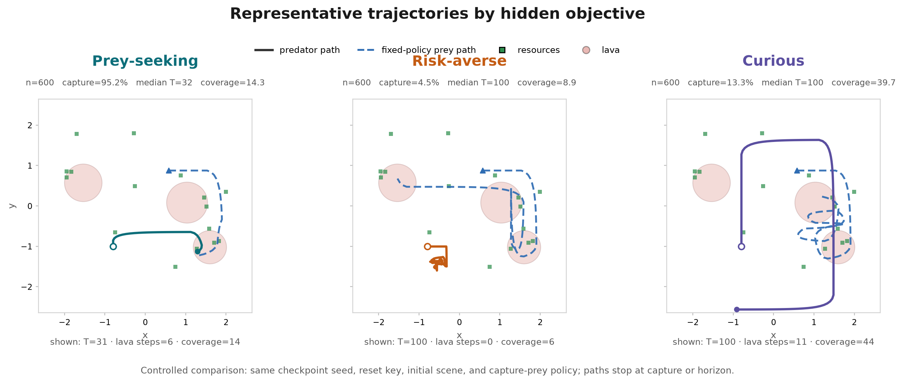

# Objective trajectory plots

## Trajectory sample overview

The overview shows 120 deterministic matched reset groups: 40 from each
checkpoint seed. Faint paths show the sample distribution, while the six bold
paths are representative joint medoids balanced across checkpoint seeds. Every
path uses only its valid prefix and stops at capture or the 100-step horizon.
The panel statistics use all 600 episodes per objective, not only the displayed
sample.

To preserve a readable common scale without clipping, the illustrative sample
is drawn from the central 90% of matched groups by joint spatial extent. See
[`trajectory-samples.json`](trajectory-samples.json) for the exact reset keys,
episode indices, valid point counts, selection rule, source dataset hash, and
figure hash.

## Synchronized representative trajectories

These animations show one deterministic matched reset from the regenerated
1,800-episode dataset. All three specialists use the same checkpoint seed,
environment key, initial scene, and fixed capture-prey control, so their paths
are directly comparable.

## Individual trajectories

### Prey-seeking

### Risk-averse

### Curious

## Static plot

[Download the vector PDF](representative-trajectories.pdf).

The GIFs share a 100-step clock. Paths reveal only their valid prefix: the
prey-seeking example captures at step 31 and then freezes, while the risk-averse
and curious examples continue to the horizon. See `animation-manifest.json` for
the source hash, selected episode indices, timing, dimensions, and output
hashes.

These are behavior rollouts from trained specialists. They do not by themselves
establish representation recovery or downstream scientific success.
